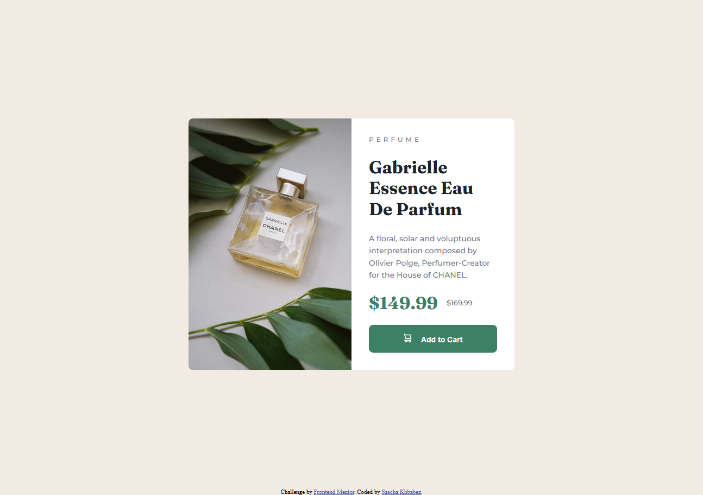

# Frontend Mentor - Product preview card component solution

This is a solution to the [Product preview card component challenge on Frontend Mentor](https://www.frontendmentor.io/challenges/product-preview-card-component-GO7UmttRfa). Frontend Mentor challenges help you improve your coding skills by building realistic projects.

## Table of contents

- [Overview](#overview)
  - [The challenge](#the-challenge)
  - [Screenshot](#screenshot)
  - [Links](#links)
- [My process](#my-process)
  - [Built with](#built-with)
  - [What I learned](#what-i-learned)
  - [Continued development](#continued-development)
  - [Useful resources](#useful-resources)

## Overview

### The challenge

Users should be able to:

- View the optimal layout depending on their device's screen size
- See hover and focus states for interactive elements

### Screenshot

### Links

- Solution URL: [Add solution URL here](https://github.com/skhbabez/product-preview-card-component-main)
- Live Site URL: [Add live site URL here](https://skhbabez.github.io/product-preview-card-component-main/)

## My process

### Built with

- Semantic HTML5 markup
- CSS custom properties
- Flexbox
- CSS Grid
- Mobile-first workflow

### What I learned

Utilizing the picture element for responsive images.

### Continued development

Practicing general Skills regarding responsiveness, especially utilizing media queries better

### Useful resources

- [Responsive images](https://web.dev/learn/design/picture-element?continue=https%3A%2F%2Fweb.dev%2Flearn%2Fdesign&hl=de#article-https://web.dev/learn/design/picture-element&hl=de) - Overall this was a good read, not kust this chapter.
